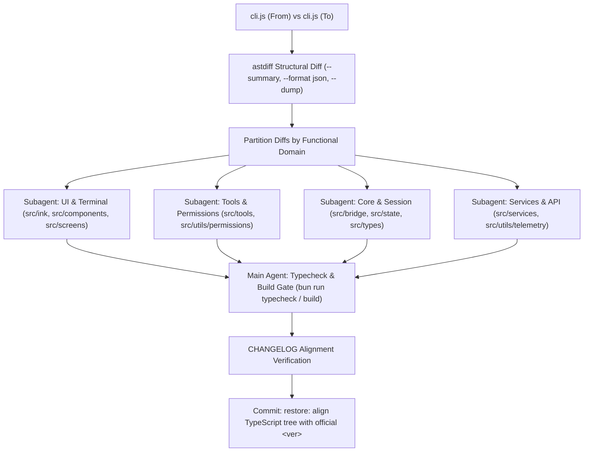

# Incremental TypeScript Restore (astdiff + Multi-Subagent)

Restore later Claude Code versions **one step at a time** onto this repo's 2.1.88 TypeScript tree.
We use **[shcv/astdiff](https://github.com/shcv/astdiff)** to extract AST-level structural deviations across bundled `cli.js` versions, and **multi-subagents** to parallelly inspect and land the concrete code changes in `src/**`.



## First actions (every run)

1. Ensure `astdiff` is installed (`cargo install --git https://github.com/shcv/astdiff`). Binary location: `astdiff` (or `E:\packages\cargo\bin\astdiff.exe`).
2. Read [inventory/version-path.json](inventory/version-path.json) for the walk order and artifact paths.
3. Read that version's block in [inventory/changelog-by-version.json](inventory/changelog-by-version.json). If the JSON is stale, read [inventory/official-CHANGELOG.md](inventory/official-CHANGELOG.md) under `## <version>`.
4. Confirm artifacts exist (`restore-work/artifacts/.../cli.js`). If missing, fetch — do not invent JS.

Refresh data (only when inventory is missing or the user asks):

```bash
node .cursor/skills/incremental-ts-restore/scripts/refresh-inventory.mjs
node .cursor/skills/incremental-ts-restore/scripts/fetch-artifacts.mjs --phase official
node .cursor/skills/incremental-ts-restore/scripts/fetch-artifacts.mjs --phase cometix --versions 2.1.113,2.1.133
```

## Version path (do not improvise)

| Phase | Versions | JS source | Notes |
|---|---|---|---|
| Baseline | 2.1.88 | this repo's TypeScript | Official npm unpublished (404) |
| Official JS | 2.1.89 – 2.1.112 | `@anthropic-ai/claude-code` `cli.js` | Still a full bundle |
| Cometix Node | 2.1.113 – latest in inventory | `@cometix/claude-code-<platform>` `cli.js` | Official npm is a thin installer |

- Switch source at **2.1.113**, not 2.1.133. 2.1.133 is a checkpoint only.
- Official 2.1.113+ has **no** analyzable JS. Never `npm pack` those as restore input.
- Cometix **2.1.113–2.1.114**: `cli.js` is in the wrapper `@cometix/claude-code`. **2.1.116+**: use the **platform** package `cli.js`.
- Detail: [reference/version-path.md](reference/version-path.md). Bridge hop: [reference/112-to-113-bridge.md](reference/112-to-113-bridge.md).

## Per-version workflow (astdiff + Multi-Subagents)

Copy this checklist and keep it updated:

```
- [ ] 1. Obtain both cli.js artifacts (fromVersion and targetVersion) + package.json
- [ ] 2. Run astdiff to generate structural diffs (--summary, --format json, --dump)
- [ ] 3. Partition AST diffs by domain (UI, Tools/Permissions, Core/Session, Services/API)
- [ ] 4. Launch parallel subagents (invoke_subagent) to review AST diffs & land TS changes
- [ ] 5. Main agent integrates, aligns CHANGELOG items, and runs quality gates (typecheck + build)
- [ ] 6. Update package.json version and git commit: `restore: align TypeScript tree with official <ver>`
```

### 1. Artifacts

- 2.1.88: `bun run build` in this repo → `dist/cli.js` (do not download).
- 2.1.89–2.1.112: `restore-work/artifacts/official/<ver>/cli.js`
- 2.1.113+: `restore-work/artifacts/cometix/<ver>/cli.js`

### 2. Structural Diff with astdiff

```bash
# 1. Structural summary (similarity %, additions, deletions, modifications, renames)
astdiff restore-work/artifacts/official/<from>/cli.js restore-work/artifacts/official/<to>/cli.js --summary

# 2. Export full AST diff to JSON
mkdir -p restore-work/diffs
astdiff restore-work/artifacts/official/<from>/cli.js restore-work/artifacts/official/<to>/cli.js --format json > restore-work/diffs/<to>.json

# 3. Create searchable dump for subagents
astdiff restore-work/artifacts/official/<from>/cli.js restore-work/artifacts/official/<to>/cli.js --dump restore-work/diffs/<to>.astdump
```

See [reference/ast-matching.md](reference/ast-matching.md).

### 3. Domain Partitioning & Subagent Dispatch

Divide the AST diff into domain scopes and invoke subagents simultaneously with clear non-overlapping directory boundaries:

- **Subagent 1: UI & Terminal** (`src/ink/`, `src/components/`, `src/screens/`)
- **Subagent 2: Tools & Permissions** (`src/tools/`, `src/utils/permissions/`, `src/utils/sandbox/`)
- **Subagent 3: Core & Session** (`src/bridge/`, `src/state/`, `src/types/`, `src/screens/REPL.tsx`)
- **Subagent 4: Services & API** (`src/services/`, `src/utils/telemetry/`, `src/utils/plugins/`)

Detailed subagent prompt templates: [reference/multi-subagent-workflow.md](reference/multi-subagent-workflow.md).

### 4. Apply TS Changes

- **Unchanged / Renamed-only functions**: Keep existing TypeScript code in `src/`. No LLM rewrite.
- **Modified / Added functions**: Update or add TypeScript code in `src/` matching the structural AST diff from `astdiff`.
- **Removed functions**: Delete or stub only if `astdiff` confirms deletion (DCE / dead code removal / feature deprecation).
- Advance one hop at a time (e.g. 2.1.97 → 2.1.98). Never jump multiple versions.

### 5. Gates & Verification

Before calling a hop complete:

1. `bun run typecheck` passes with **0 errors**.
2. `bun run build` succeeds and produces `dist/cli.js`.
3. All target CHANGELOG items are verified against `astdiff` outputs.

Full rules: [reference/quality-gates.md](reference/quality-gates.md).

## Hard rules

1. Never declare done from a skim or superficial review.
2. Never LLM-rewrite a function that has no structural changes in `astdiff`.
3. Never use official npm 2.1.113+ as JS input (it is a thin binary installer without JS).
4. 2.1.112 → 2.1.113 bridge must compare **unpatched SEA** `cli.js` first, then isolate Cometix P1–P9 patches. See [reference/112-to-113-bridge.md](reference/112-to-113-bridge.md) and [reference/cometix-patches.md](reference/cometix-patches.md).
5. One hop at a time; maintain a clean, verifiable git commit history.
