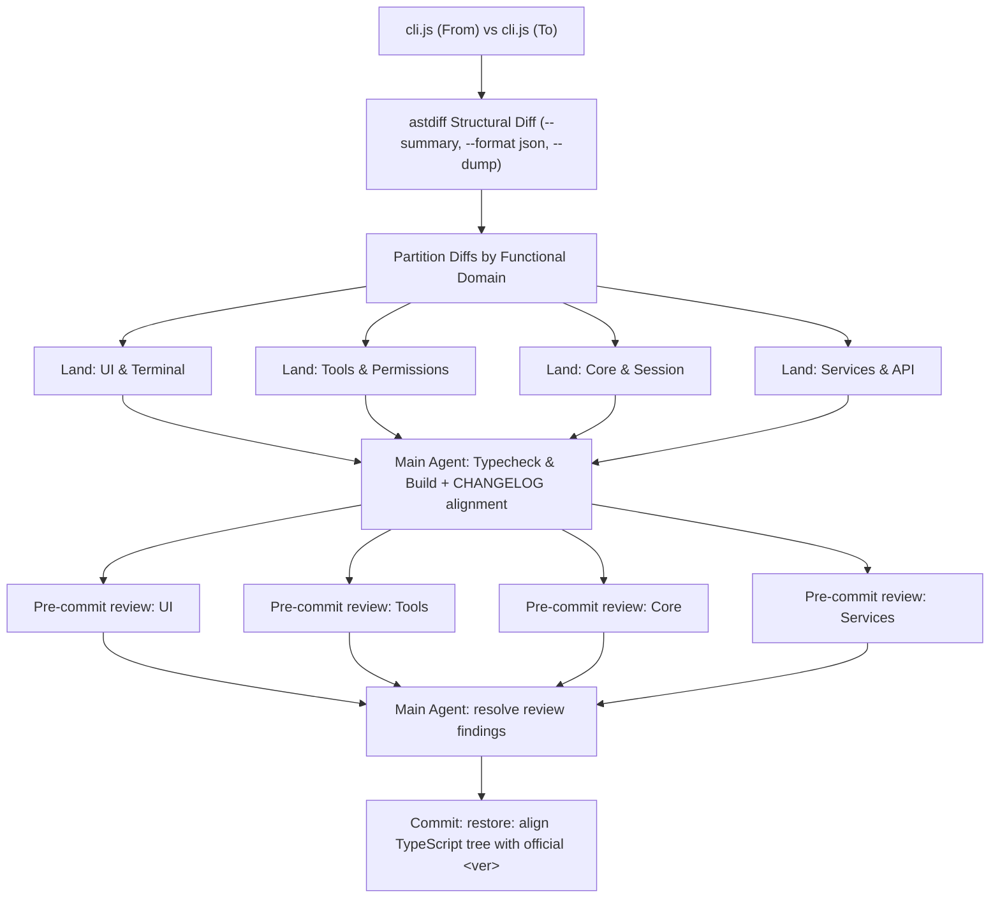

# Incremental TypeScript Restore (astdiff + Multi-Subagent)

Restore later Claude Code versions **one step at a time** onto this repo's 2.1.88 TypeScript tree.
We use **[shcv/astdiff](https://github.com/shcv/astdiff)** to extract AST-level structural deviations across bundled `cli.js` versions, and **multi-subagents** to parallelly inspect and land the concrete code changes in `src/**`.



## First actions (every run)

1. Ensure `astdiff` is installed (`cargo install --git https://github.com/shcv/astdiff`). Binary location: `astdiff` (or `E:\packages\cargo\bin\astdiff.exe`).
2. Read [inventory/version-path.json](inventory/version-path.json) for the walk order and artifact paths.
3. Read that version's block in [inventory/changelog-by-version.json](inventory/changelog-by-version.json). If the JSON is stale, read [inventory/official-CHANGELOG.md](inventory/official-CHANGELOG.md) under `## <version>`.
4. Confirm artifacts exist (`restore-work/artifacts/.../cli.js`). If missing, fetch — do not invent JS.

Refresh data (only when inventory is missing or the user asks):

```bash
node .cursor/skills/incremental-ts-restore/scripts/refresh-inventory.mjs
node .cursor/skills/incremental-ts-restore/scripts/fetch-artifacts.mjs --phase official
node .cursor/skills/incremental-ts-restore/scripts/fetch-artifacts.mjs --phase cometix --versions 2.1.113,2.1.133
```

## Version path (do not improvise)

| Phase | Versions | JS source | Notes |
|---|---|---|---|
| Baseline | 2.1.88 | this repo's TypeScript | Official npm unpublished (404) |
| Official JS | 2.1.89 – 2.1.112 | `@anthropic-ai/claude-code` `cli.js` | Still a full bundle |
| Cometix Node | 2.1.113 – latest in inventory | `@cometix/claude-code-<platform>` `cli.js` | Official npm is a thin installer |

- Switch source at **2.1.113**, not 2.1.133. 2.1.133 is a checkpoint only.
- Official 2.1.113+ has **no** analyzable JS. Never `npm pack` those as restore input.
- Cometix **2.1.113–2.1.114**: `cli.js` is in the wrapper `@cometix/claude-code`. **2.1.116+**: use the **platform** package `cli.js`.
- Detail: [reference/version-path.md](reference/version-path.md). Bridge hop: [reference/112-to-113-bridge.md](reference/112-to-113-bridge.md).

## Per-version workflow (astdiff + Multi-Subagents)

Copy this checklist and keep it updated:

```
- [ ] 0. Record the typecheck baseline from a clean HEAD worktree (see Gates)
- [ ] 1. Obtain both cli.js artifacts (fromVersion and targetVersion) + package.json
- [ ] 2. Run astdiff to generate structural diffs (--summary, --format json, --dump)
- [ ] 3. Write the changelog scout doc: every CHANGELOG row → unique-token count delta → verdict
- [ ] 4. Partition by domain and launch parallel subagents to land TS changes
- [ ] 5. Main agent integrates, aligns CHANGELOG items, and runs the gates
       (typecheck delta == 0 new errors, build succeeds, unique tokens present in dist/cli.js)
- [ ] 6. Write restore-work/ledgers/<ver>.json (one row per CHANGELOG item, with evidence)
- [ ] 7. Launch a second wave of parallel subagents to audit landed TS vs astdiff + CHANGELOG (read-only review)
- [ ] 8. Main agent resolves every blocking review finding. If any reviewer is FAIL / silent / unresponsive, do not commit — retry the review wave
- [ ] 9. Update package.json version and git commit: `restore: align TypeScript tree with official <ver>`
```

### 1. Artifacts

- 2.1.88: `bun run build` in this repo → `dist/cli.js` (do not download).
- 2.1.89–2.1.112: `restore-work/artifacts/official/<ver>/cli.js`
- 2.1.113+: `restore-work/artifacts/cometix/<ver>/cli.js`

### 2. Structural Diff with astdiff

```bash
# 1. Structural summary (similarity %, additions, deletions, modifications, renames)
astdiff restore-work/artifacts/official/<from>/cli.js restore-work/artifacts/official/<to>/cli.js --summary

# 2. Export full AST diff to JSON
mkdir -p restore-work/diffs
astdiff restore-work/artifacts/official/<from>/cli.js restore-work/artifacts/official/<to>/cli.js --format json > restore-work/diffs/<to>.json

# 3. Create searchable dump for subagents
astdiff restore-work/artifacts/official/<from>/cli.js restore-work/artifacts/official/<to>/cli.js --dump restore-work/diffs/<to>.astdump
```

See [reference/ast-matching.md](reference/ast-matching.md).

**Reading the bundles.** `cli.js` is a ~14 MB **single line**. Never `cat`, `head`, or `rg -o` it — one match prints megabytes and blows the context. Extract windows instead:

```bash
node -e 'const s=require("fs").readFileSync("restore-work/artifacts/cometix/2.1.129/cli.js","utf8");
let i=s.indexOf("function na(");console.log(s.slice(i,i+800))'
```

Count a token in both versions to classify it (`0→N` = new product; `N/N` = shared; `N→0` = removed):

```bash
node -e 'const fs=require("fs");
const c=(f,t)=>{const s=fs.readFileSync(f,"utf8");let n=0,i=-1;while((i=s.indexOf(t,i+1))!==-1)n++;return n};
for (const t of ["--plugin-url","isInWorkingDir"])
  console.log(t, c("…/2.1.128/cli.js",t), "→", c("…/2.1.129/cli.js",t))'
```

### 3. Changelog scout (write this before landing anything)

Produce `restore-work/diffs/<ver>-changelog-scout.md` with one row per official CHANGELOG item:

| column | meaning |
|---|---|
| `item` | the CHANGELOG line verbatim |
| `domain` | ui / tools / core / services / vscode |
| evidence | token counts `128→129`, plus the astdiff function pair and similarity |
| verdict | `product` (has a 129-unique token — land first) · `shared/logic-only` (no unique string — land from AST only, or defer) · `absent-in-bundle` · `do-not-land` |

Also list, in a separate section, **ast-only product** — genuine structural changes with unique strings that the CHANGELOG omitted. These are real and must be decided per item at land time, not silently deferred to a later hop.

This doc is the contract for the rest of the hop: the landing subagents work from it, the ledger mirrors it, and the reviewers check against it.

### 3b. Domain Partitioning & Subagent Dispatch

Divide the AST diff into domain scopes and invoke subagents simultaneously with clear non-overlapping directory boundaries:

- **Subagent 1: UI & Terminal** (`src/ink/`, `src/components/`, `src/screens/`)
- **Subagent 2: Tools & Permissions** (`src/tools/`, `src/utils/permissions/`, `src/utils/sandbox/`)
- **Subagent 3: Core & Session** (`src/bridge/`, `src/state/`, `src/types/`, `src/screens/REPL.tsx`)
- **Subagent 4: Services & API** (`src/services/`, `src/utils/telemetry/`, `src/utils/plugins/`)

Detailed subagent prompt templates: [reference/multi-subagent-workflow.md](reference/multi-subagent-workflow.md).

### 4. Apply TS Changes

- **Unchanged / Renamed-only functions**: Keep existing TypeScript code in `src/`. No LLM rewrite.
- **Modified / Added functions**: Update or add TypeScript code in `src/` matching the structural AST diff from `astdiff`.
- **Removed functions**: Delete or stub only if `astdiff` confirms deletion (DCE / dead code removal / feature deprecation).
- Advance one hop at a time (e.g. 2.1.97 → 2.1.98). Never jump multiple versions.

Four landing habits that this walk keeps needing:

1. **"X now works" means the previous version had a stub.** Diff the *body* of the function in both bundles, not just the token counts. 2.1.128 shipped `function qfH(H){return "on"}` — `skillOverrides` appeared everywhere in 128 and did nothing. The same class of bug is a parameter the old version accepted and ignored: 128's skill-budget formatter took a scorer argument and never read it. If the hop's row says *now works* / *no longer ignored* / *is now honored*, assume a stub until the two bodies prove otherwise.
2. **Land the call sites, not just the definition.** A new helper is inert until its consumers exist. `na` needed `yL5`/`kw8`/`xR5` wired into the Skill tool, the command filters, the typeahead, the listing budget, and the dialog. Grep the minified helper name across the bundle and land every hit.
3. **Trace the value end to end.** A new field on a result type is only real once a producer sets it and a consumer reads it. Follow the plumbing in the bundle before declaring the row landed.
4. **Ast-only product that the CHANGELOG omits still counts** when it lives in a function you are already touching. Land it and say so in the ledger `notes` — do not let it silently ride along.

When landing surfaces a **pre-existing gap from an earlier hop**, record it in the ledger `notes` and move on. Do not expand the hop's scope to backfill it.

### 5. Gates & Verification

Before calling a hop complete, all five must hold:

1. **Typecheck delta is zero.** This tree does **not** typecheck at 0 errors, and it never has — HEAD carries thousands of pre-existing errors from stub generation and missing vendor types. The gate is *no new errors*, measured against a clean-HEAD baseline:

   ```bash
   git worktree add /tmp/ccbase HEAD
   (cd /tmp/ccbase && bun run typecheck 2>&1 | grep -oE '^src/[^(]+' | sort | uniq -c | sort -k2) > /tmp/base_counts.txt
   bun run typecheck 2>&1 | grep -oE '^src/[^(]+' | sort | uniq -c | sort -k2 > /tmp/now.txt
   diff /tmp/base_counts.txt /tmp/now.txt   # must be empty, or show only decreases
   ```

   Per-file counts, not a total: a total can stay flat while a new error hides behind a fixed one. Take the baseline **before** landing (checklist step 0), and re-diff after every batch so a regression is attributed to the edit that caused it.

2. **`bun run build` succeeds.** Every version must build. No hop is complete, and no hop is committed, while the build is red — not "typecheck is close enough", not "it's only the UI file". If a landing leaves the build broken, either finish it or revert it within the same hop.

3. **The hop's unique tokens are present in `dist/cli.js`.** Building green is not the same as landing the feature — dead code, an unexported helper, or an unreferenced module all build fine. Assert the scout doc's unique tokens actually reached the bundle:

   ```bash
   for t in CLAUDE_CODE_PACKAGE_MANAGER_AUTO_UPDATE --plugin-url extended-cache-ttl-2025-04-11; do
     printf '%-45s %s\n' "$t" "$(grep -c -F -- "$t" dist/cli.js)"
   done
   ```

   Every `product` row in the scout doc needs a non-zero count. A zero means the code is unreachable from the entry point.

4. **The ledger is written** — `restore-work/ledgers/<ver>.json`, one row per CHANGELOG item with a status of `located` / `partial` / `shared-logic` / `absent-in-bundle`, and evidence naming the official minified identifier.

5. **The pre-commit parallel review wave (§6) has reported and every blocking finding is cleared.**

Full rules: [reference/quality-gates.md](reference/quality-gates.md).

### 6. Pre-commit Parallel Review (mandatory)

After landing and gates, and **before** the restore commit, spawn a second set of domain subagents. These reviewers do **not** land new hop work. They audit:

- Every genuine `astdiff` add / remove / structural edit in their domain is either landed in `src/` or explicitly classified (rename-only, vendor, minify, default-false growthbook, absent-in-bundle).
- Every official CHANGELOG item for `<ver>` that belongs to their domain is `located` or confirmed absent, with evidence.
- No next-hop behavior was pulled forward.

Write findings to `restore-work/diffs/<ver>-<domain>-review.md`. A silent or unresponsive reviewer is a **FAIL**. The main agent may not substitute its own skim for a missing reviewer. Re-dispatch until all four domains report.

**Write review prompts to be self-contained.** A reviewer starts with no memory of the hop. Give it: the exact list of changed files in its domain, the official minified identifiers to compare against (`na`, `jr1`, `M04`, …), the bundle paths, the `node -e` extraction recipe, the exact output path, and the required section headings (`## Verdict` / `## Findings` / `## Verified-correct`). A reviewer that has to rediscover the hop burns its budget on search and dies before it reports. Also name the one thing in its domain most likely to be wrong — a permission deferral, a settings-file write, a download path — so it spends its attention there.

Prompt templates: [reference/multi-subagent-workflow.md](reference/multi-subagent-workflow.md) §6.

### 7. When subagents die

Landing subagents fail on long hops (`deadline_exceeded`, decrypt errors). The hop does not stall:

- **A landing subagent dies** → the main agent lands that domain's changes directly, in small batches, re-running the typecheck delta after each batch.
- **A reviewer dies** → re-dispatch it. This one is not substitutable: the main agent reviewing its own landing is exactly the failure mode the review wave exists to catch.
- Prefer many small edits over one large one. Long edits get interrupted, and a half-applied edit is harder to diagnose than a missing one.

## Hard rules

1. Never declare done from a skim or superficial review.
2. Never LLM-rewrite a function that has no structural changes in `astdiff`.
3. Never use official npm 2.1.113+ as JS input (it is a thin binary installer without JS).
4. 2.1.112 → 2.1.113 bridge must compare **unpatched SEA** `cli.js` first, then isolate Cometix P1–P9 patches. See [reference/112-to-113-bridge.md](reference/112-to-113-bridge.md) and [reference/cometix-patches.md](reference/cometix-patches.md).
5. One hop at a time; maintain a clean, verifiable git commit history.
6. Never commit a hop without a completed pre-commit parallel review wave. Main-agent-only review does not count.
7. **Every version must build.** `bun run build` green, and the hop's unique tokens present in `dist/cli.js`. A hop that does not build is not a hop.
8. Never invent behavior the bundle does not contain. If the changelog implies a platform variant (a Linux equivalent of a Windows fix, say) and the bundle has no such code, land the official body as-is and note the asymmetry. Copy strings are verbatim from the bundle, never paraphrased.
9. Never treat CRLF churn as a change. This tree's working copy is line-ending noisy — use `git diff --ignore-all-space --stat` to find the real diff before reviewing or committing.
