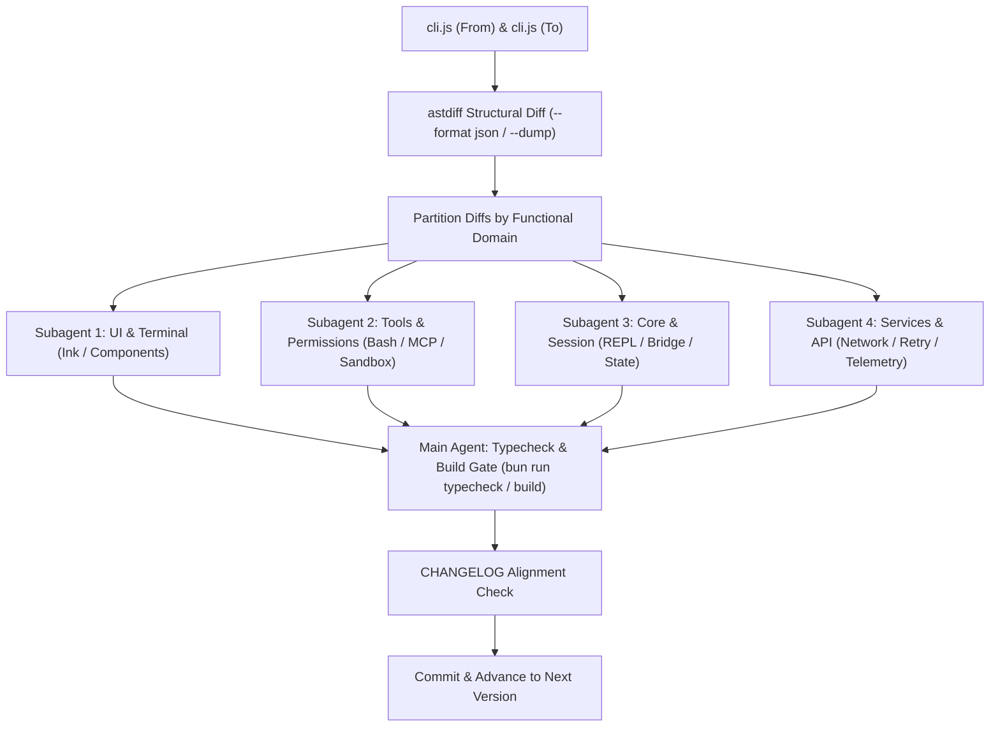

# Multi-Subagent Restore Workflow (astdiff-driven)

This guide details how to orchestrate multiple subagents to parallelly review AST structural diffs generated by `astdiff` and land TypeScript changes across versions.

## Overview Architecture



---

## Step-by-Step Execution

### 1. Generate & Export AST Diffs

For the hop `<from>` → `<to>`:

```bash
# 1. Summary overview (using astdiff or E:\packages\cargo\bin\astdiff.exe)
astdiff restore-work/artifacts/official/<from>/cli.js restore-work/artifacts/official/<to>/cli.js --summary

# 2. Export full structural diff in JSON format
mkdir -p restore-work/diffs
astdiff restore-work/artifacts/official/<from>/cli.js restore-work/artifacts/official/<to>/cli.js --format json > restore-work/diffs/<to>.json

# 3. Create searchable dump for interactive inspection
astdiff restore-work/artifacts/official/<from>/cli.js restore-work/artifacts/official/<to>/cli.js --dump restore-work/diffs/<to>.astdump
```

---

### 2. Partition Diffs by Functional Domain

Inspect `restore-work/diffs/<to>.json` and group modified / added functions by target subsystem:

| Domain | Scope in `src/` | Typical Subsystems |
|---|---|---|
| **UI & Terminal** | `src/ink/`, `src/components/`, `src/screens/` | Ink layout, border rendering, screen buffer, React UI components |
| **Tools & Permissions** | `src/tools/`, `src/utils/permissions/`, `src/utils/sandbox/` | BashTool, FileEditTool, MCPTool, PermissionMode, path validation |
| **Core & Session** | `src/bridge/`, `src/state/`, `src/types/`, `src/screens/REPL.tsx` | createSession, AppStateStore, Message types, REPL handling |
| **Services, API & MCP** | `src/services/`, `src/utils/telemetry/`, `src/utils/plugins/` | API client, retry logic, MCP auth, telemetry tracing |

---

### 3. Launch Parallel Subagents (`invoke_subagent`)

Use `invoke_subagent` to spawn specialized subagents simultaneously. Each subagent gets a distinct file boundary to prevent write collisions.

#### Subagent Dispatch Template

```json
{
  "Subagents": [
    {
      "TypeName": "self",
      "Role": "UI & Terminal Restorer",
      "Prompt": "You are responsible for restoring UI and Terminal changes for version <ver>.\n\n1. Review the AST diffs for UI/Terminal declarations in restore-work/diffs/<ver>.json (or via `astdiff query restore-work/diffs/<ver>.astdump find <fn>`).\n2. Align the corresponding CHANGELOG items: <list relevant UI items>.\n3. Modify only the necessary TypeScript files under `src/ink/`, `src/components/`, `src/screens/`.\n4. Ensure strict type compatibility with existing interfaces."
    },
    {
      "TypeName": "self",
      "Role": "Tools & Permissions Restorer",
      "Prompt": "You are responsible for restoring Tools and Permissions changes for version <ver>.\n\n1. Review the AST diffs for Tool and Permission declarations in restore-work/diffs/<ver>.json.\n2. Align the corresponding CHANGELOG items: <list relevant Tool/Permission items>.\n3. Update TypeScript files under `src/tools/`, `src/utils/permissions/`, `src/utils/sandbox/`.\n4. Keep unchanged logic untouched."
    },
    {
      "TypeName": "self",
      "Role": "Core & Services Restorer",
      "Prompt": "You are responsible for restoring Core, Session and Services changes for version <ver>.\n\n1. Review the AST diffs for API, Bridge, Session, and State declarations in restore-work/diffs/<ver>.json.\n2. Align the corresponding CHANGELOG items: <list relevant Core/Service items>.\n3. Update TypeScript files under `src/bridge/`, `src/services/`, `src/state/`, `src/types/`."
    }
  ]
}
```

---

### 4. Integration & Quality Gates

Once all subagents have completed their tasks:

1. **Full Workspace Typecheck**:
   ```bash
   bun run typecheck
   ```
   Must pass with **0 errors**. If there are type mismatches across module boundaries, fix them.

2. **Production Bundle Build**:
   ```bash
   bun run build
   ```
   Verify that `dist/cli.js` builds cleanly.

3. **CHANGELOG Completeness Verification**:
   Verify that 100% of the CHANGELOG items for `<ver>` are reflected in the code or confirmed absent in CLI bundle.

---

### 5. Commit and Advance

1. Update version in `package.json` to `<ver>`.
2. Commit:
   ```bash
   git add package.json src/ restore-work/diffs/
   git commit -m "restore: align TypeScript tree with official <ver>"
   ```
3. Update baseline to `<ver>` and proceed to next hop in `version-path.json`.
