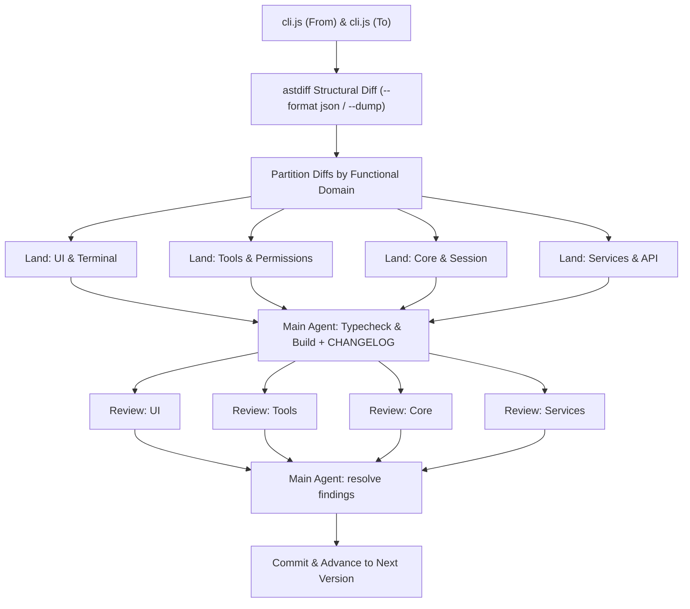

# Multi-Subagent Restore Workflow (astdiff-driven)

This guide details how to orchestrate multiple subagents to parallelly review AST structural diffs generated by `astdiff` and land TypeScript changes across versions.

## Overview Architecture



---

## Step-by-Step Execution

### 1. Generate & Export AST Diffs

For the hop `<from>` → `<to>`:

```bash
# 1. Summary overview (using astdiff or E:\packages\cargo\bin\astdiff.exe)
astdiff restore-work/artifacts/official/<from>/cli.js restore-work/artifacts/official/<to>/cli.js --summary

# 2. Export full structural diff in JSON format
mkdir -p restore-work/diffs
astdiff restore-work/artifacts/official/<from>/cli.js restore-work/artifacts/official/<to>/cli.js --format json > restore-work/diffs/<to>.json

# 3. Create searchable dump for interactive inspection
astdiff restore-work/artifacts/official/<from>/cli.js restore-work/artifacts/official/<to>/cli.js --dump restore-work/diffs/<to>.astdump
```

---

### 2. Partition Diffs by Functional Domain

Inspect `restore-work/diffs/<to>.json` and group modified / added functions by target subsystem:

| Domain | Scope in `src/` | Typical Subsystems |
|---|---|---|
| **UI & Terminal** | `src/ink/`, `src/components/`, `src/screens/` | Ink layout, border rendering, screen buffer, React UI components |
| **Tools & Permissions** | `src/tools/`, `src/utils/permissions/`, `src/utils/sandbox/` | BashTool, FileEditTool, MCPTool, PermissionMode, path validation |
| **Core & Session** | `src/bridge/`, `src/state/`, `src/types/`, `src/screens/REPL.tsx` | createSession, AppStateStore, Message types, REPL handling |
| **Services, API & MCP** | `src/services/`, `src/utils/telemetry/`, `src/utils/plugins/` | API client, retry logic, MCP auth, telemetry tracing |

---

### 3. Launch Parallel Subagents (`invoke_subagent`)

Use `invoke_subagent` to spawn specialized subagents simultaneously. Each subagent gets a distinct file boundary to prevent write collisions.

#### Subagent Dispatch Template

```json
{
  "Subagents": [
    {
      "TypeName": "self",
      "Role": "UI & Terminal Restorer",
      "Prompt": "You are responsible for restoring UI and Terminal changes for version <ver>.\n\n1. Review the AST diffs for UI/Terminal declarations in restore-work/diffs/<ver>.json (or via `astdiff query restore-work/diffs/<ver>.astdump find <fn>`).\n2. Align the corresponding CHANGELOG items: <list relevant UI items>.\n3. Modify only the necessary TypeScript files under `src/ink/`, `src/components/`, `src/screens/`.\n4. Ensure strict type compatibility with existing interfaces."
    },
    {
      "TypeName": "self",
      "Role": "Tools & Permissions Restorer",
      "Prompt": "You are responsible for restoring Tools and Permissions changes for version <ver>.\n\n1. Review the AST diffs for Tool and Permission declarations in restore-work/diffs/<ver>.json.\n2. Align the corresponding CHANGELOG items: <list relevant Tool/Permission items>.\n3. Update TypeScript files under `src/tools/`, `src/utils/permissions/`, `src/utils/sandbox/`.\n4. Keep unchanged logic untouched."
    },
    {
      "TypeName": "self",
      "Role": "Core & Services Restorer",
      "Prompt": "You are responsible for restoring Core, Session and Services changes for version <ver>.\n\n1. Review the AST diffs for API, Bridge, Session, and State declarations in restore-work/diffs/<ver>.json.\n2. Align the corresponding CHANGELOG items: <list relevant Core/Service items>.\n3. Update TypeScript files under `src/bridge/`, `src/services/`, `src/state/`, `src/types/`."
    }
  ]
}
```

---

### 4. Integration & Quality Gates

Once all subagents have completed their tasks:

1. **Full Workspace Typecheck**:
   ```bash
   bun run typecheck
   ```
   Gate is **no new errors vs a clean-HEAD worktree baseline** (per-file counts). This tree does not typecheck at 0 and never has. See [quality-gates.md](quality-gates.md) §2.

2. **Production Bundle Build (hard)**:
   ```bash
   bun run build
   ```
   Every version must produce `dist/cli.js`. Then assert the hop's unique tokens appear in that bundle (dead/unreferenced code builds green). See [quality-gates.md](quality-gates.md) §3–§4.

3. **CHANGELOG Completeness Verification**:
   Verify that 100% of the CHANGELOG items for `<ver>` are reflected in the code or confirmed absent in CLI bundle.

Do **not** commit yet. The hop is not done until §5 passes.

---

### 5. Pre-commit Parallel Review (mandatory, second wave)

After landing + typecheck + build + CHANGELOG alignment, spawn a **new** set of domain subagents. These are reviewers, not restorers:

- Read-only by default. They may only write `restore-work/diffs/<ver>-<domain>-review.md`.
- They re-read `restore-work/diffs/<ver>.json` / `.astdump` and the landed `src/` diff.
- They must not start the next hop, and must not pull later-version behavior.

A hop **cannot** be committed if any reviewer is silent, unresponsive, or reports `FAIL`. The main agent must not substitute its own skim for a missing reviewer — re-dispatch that domain until it reports.

#### Reviewer Dispatch Template

```json
{
  "Subagents": [
    {
      "TypeName": "self",
      "Role": "UI & Terminal Reviewer",
      "Prompt": "Read-only pre-commit review for version <ver>. Do not land new hop work.\n\n1. Re-read restore-work/diffs/<ver>.json (or astdiff query the .astdump) for UI/Terminal declarations.\n2. Diff the landed TypeScript under src/ink/, src/components/, src/screens/ against those AST changes.\n3. Re-check CHANGELOG items that belong to this domain: <list>. Each must be located in src/ or confirmed absent-in-bundle / unrelated-packaging, with evidence.\n4. Flag any next-hop behavior that leaked in.\n5. Write restore-work/diffs/<ver>-ui-review.md with verdict PASS or FAIL and a finding list. Silent/empty report is FAIL."
    },
    {
      "TypeName": "self",
      "Role": "Tools & Permissions Reviewer",
      "Prompt": "Read-only pre-commit review for version <ver>. Do not land new hop work.\n\n1. Re-read AST diffs for tools/permissions/sandbox.\n2. Diff landed TypeScript under src/tools/, src/utils/permissions/, src/utils/sandbox/.\n3. Re-check domain CHANGELOG items: <list>.\n4. Write restore-work/diffs/<ver>-tools-review.md with PASS or FAIL."
    },
    {
      "TypeName": "self",
      "Role": "Core & Session Reviewer",
      "Prompt": "Read-only pre-commit review for version <ver>. Do not land new hop work.\n\n1. Re-read AST diffs for bridge/state/types/REPL.\n2. Diff landed TypeScript under src/bridge/, src/state/, src/types/, src/screens/REPL.tsx.\n3. Re-check domain CHANGELOG items: <list>.\n4. Write restore-work/diffs/<ver>-core-review.md with PASS or FAIL."
    },
    {
      "TypeName": "self",
      "Role": "Services & API Reviewer",
      "Prompt": "Read-only pre-commit review for version <ver>. Do not land new hop work.\n\n1. Re-read AST diffs for services/telemetry/plugins.\n2. Diff landed TypeScript under src/services/, src/utils/telemetry/, src/utils/plugins/.\n3. Re-check domain CHANGELOG items: <list>.\n4. Write restore-work/diffs/<ver>-services-review.md with PASS or FAIL."
    }
  ]
}
```

If any report is `FAIL`, the main agent fixes the findings and **re-runs this review wave**. Do not commit on a failed or incomplete wave.

---

### 6. Commit and Advance

Only after §5 reviewers all report `PASS` (or `FAIL` findings have been fixed and the wave re-run to `PASS`):

1. Update version in `package.json` to `<ver>`.
2. Commit:
   ```bash
   git add package.json src/ restore-work/diffs/ restore-work/ledgers/<ver>.json
   git commit -m "restore: align TypeScript tree with official <ver>"
   ```
3. Update baseline to `<ver>` and proceed to next hop in `version-path.json`.
